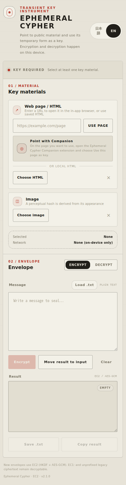

# Ephemeral Cypher Android v0.1.7

  

Ephemeral Cypher is an Android edition of the project that turns a web page, saved HTML, or image-derived material into cryptographic key material.

This version includes an in-app browser flow for capturing a page locally on the device and using its normalized visible text as the basis for encryption and decryption.

---

## What it does

Ephemeral Cypher lets you encrypt text using a page-derived fingerprint instead of directly sharing a password.

Instead of exchanging a key string, only a person who can reproduce the same source material can decrypt the message.

If the page changes, the key changes, and the encrypted text will no longer open.

---

## Main flow

1. Open Ephemeral Cypher.
2. Enter an HTTPS URL and tap **ページを鍵にする**.
3. The page opens in the in-app browser.
4. If needed, log in to the site there.
5. After the page is fully displayed, tap **このページを鍵にする**.
6. The app reads the currently displayed DOM text locally, normalizes it, computes a SHA-256 fingerprint on-device, and returns to the main encryption UI.
7. Encrypt or decrypt using the resulting page fingerprint.

The Android Share menu can also be used as a shortcut. When an HTTPS page is shared to Ephemeral Cypher, the app opens that page in the same in-app browser, where the user explicitly chooses when to capture it.

---

## TXT save / load

- Encrypted text can be saved as a `.txt` file with **TXTで保存**.
- Saved text can be loaded again with **TXTを読み込む**.
- After loading saved cipher text, the app switches into the decrypt workflow.
- Copy and paste can also be used.

---

## Security model

- HTTPS pages only
- Cleartext HTTP is disabled in the Android manifest
- No third-party relay server
- No `addJavascriptInterface()` bridge exposed to browsed pages
- The packaged UI communicates with native Android only through a private custom navigation command intercepted by the app
- WebView local file/content access is disabled
- File-URL and universal file-URL access are disabled
- Mixed content is blocked
- Safe Browsing is enabled
- JavaScript pop-up windows and multiple windows are disabled
- Third-party cookies are disabled
- First-party cookies are allowed so standard site login can work
- Page text and generated fingerprints are not sent to the developer or a relay service

The target website still receives the normal direct page request from the device.

---

## PC compatibility

The visible-text normalization and SHA-256 page-fingerprint procedure is intended to stay aligned with the PC-side Ephemeral Cypher workflow.

Stable pages may therefore be cross-compatible between PC and Android.

However, dynamic, personalized, A/B-tested, geolocated, or time-varying pages may still produce different fingerprints across devices or sessions.

---

## Build

Open this folder in Android Studio, sync Gradle, then run on Android 8.0+.

To generate a release APK:

**Build > Generate Signed App Bundle or APK > APK**

Package name:

`com.masatonasu.ephemeralcypher`

---

## Version

Current version: **v0.1.7**

---

## License

MIT
