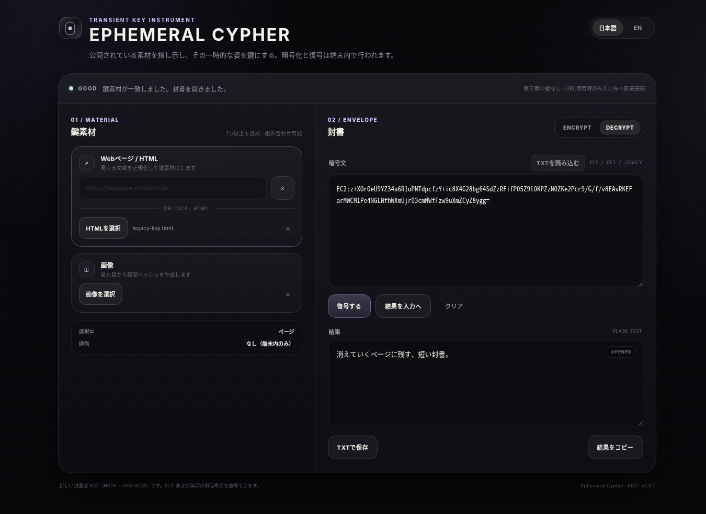

# Ephemeral Cypher / エフェメラルサイファー

Webページ、ローカルHTML、画像の「その時点の姿」から鍵を導出し、メッセージを暗号化するクライアントサイド・ツールです。

鍵文字列を直接共有する代わりに、同じ素材を再現できる人だけが封書を開けます。ページや画像が変われば鍵も変わり、暗号文は開かなくなります。

**Live:** https://masato-nasu.github.io/Ephemeral-Cypher/

## v2.0.1 の変更

- 題名をセリフ体から端正なサンセリフ体へ変更
- 一節を鍵にする機能を削除
- 暗号化結果を `.txt` ファイルとして保存可能
- 保存した `.txt` を読み込むと、暗号文欄へ入り自動で復号モードへ移行
- Service Workerのキャッシュを更新

## v2.0.0 から継続する改良

- **第三者中継を完全に削除**  
  CORSなどでURLを取得できない場合も、`r.jina.ai` や別のミラーへURLを送信しません。入力したURLへ直接接続できなければ、HTML保存・添付を案内します。

- **「不一致」と「到達不能」を分離**  
  - `GOOD`：同じ素材で復号できた
  - `OOPS`：素材には到達したが鍵が一致しない
  - `UNREACHABLE`：素材へ到達できず、生死を判定できない

- **新形式 EC2**  
  新しい暗号文は `EC2:` で始まり、素材種別を分離したうえで **HKDF-SHA-256** により AES-256-GCM 鍵を導出します。AES-GCMにはEC2用の追加認証データも設定しています。

- **旧暗号文との互換性を維持**  
  `EC1:` および接頭辞なしの旧暗号文は、従来の鍵導出経路で復号します。

## 使い方

1. 鍵素材を1つ以上選びます。
   - WebページURL、または保存したHTML
   - 画像
2. `ENCRYPT` で文章を入力し、**暗号化する**を押します。
3. 結果欄の **TXTで保存** を押すと、暗号文をファイルとして保存できます。
4. 復号時は同じ鍵素材を用意し、**TXTを読み込む**から保存ファイルを選びます。
5. 自動的に `DECRYPT` モードへ切り替わるので、**復号する**を押します。

暗号文はコピー＆ペーストでも使用できます。

## URLが取得できない場合

ブラウザから直接取得できるページだけがURL鍵として使用できます。CORS、認証、robots設定、ネットワーク障害などで取得できない場合は `UNREACHABLE` になります。

そのページをブラウザで保存し、**ローカルHTML**として選択してください。第三者の中継サービスへURLを送るフォールバックはありません。

## 鍵素材の処理

### Webページ / HTML

`script`、`style`、`noscript` を除去し、タイトルと見える文章を取り出して空白を正規化します。処理量を抑えるため、先頭200,000文字を使用します。この正規化仕様は旧版から変更していません。

### 画像

32×32ピクセルへ縮小し、DCTによる64bitの知覚ハッシュを生成します。見た目の近い画像を同じ素材として扱いやすい反面、ファイル全体の暗号学的ハッシュではなく、衝突や推測への耐性は限定的です。

## 暗号形式

### EC2（新規暗号化）

- HKDF-SHA-256
- AES-256-GCM
- 16-byte salt
- 12-byte IV
- 素材種別のタグ分離
- `EC2:` 接頭辞

### EC1 / 無印（旧形式の復号）

旧版と同じ `EC|1.1.2|` の導出経路を残しています。新しく暗号化するときはEC2だけを出力します。

## セキュリティ上の注意

この作品は「公開素材の一時性を鍵にする」という発想の実装です。暗号処理自体にはブラウザ標準のWeb Crypto APIを使用しますが、**素材が公開されている場合、素材を特定できる人は同じ鍵を再導出できます**。安全性は、指し示した素材や組み合わせが第三者に推測されにくいことに依存します。

また、独立した第三者監査を受けた暗号製品ではありません。重要な個人情報、業務秘密、法令上の保護が必要なデータには、監査済みの暗号化ツールを使用してください。

URLを使う場合のみ、入力したURLのサーバーへ直接通信します。HTMLまたは画像を使う場合、鍵導出と暗号処理は端末内で完結します。

## PWA

ビルド不要の静的サイトです。`index.html`、`manifest.json`、`sw.js`、アイコンをそのままGitHub PagesやCloudflare Pagesへ配置できます。

Service Worker v2.0.1は、新しいキャッシュ名を使用して旧UIの残留を防ぎます。

## License

MIT
