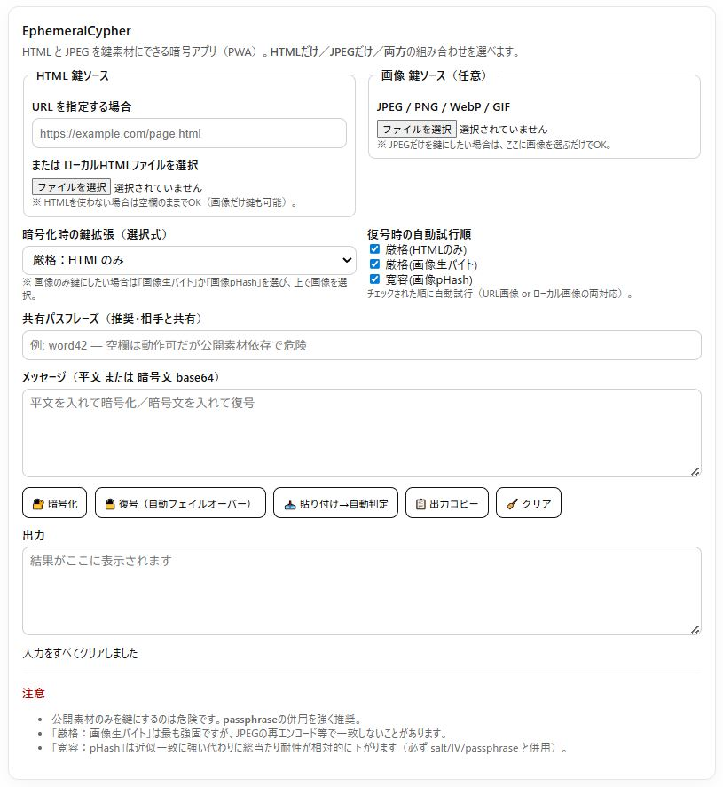

# EphemeralCypher / エフェメラルサイファー

**Website/HTML と 画像から“鍵”を生成して暗号化する**、超軽量・クライアントサイド暗号ツール。  
「鍵そのもの」を渡さず、**同じ素材（URL/HTML/画像）を共有できる人だけが復号できる**、という発想のシンプルな実装です。  
PWA対応（インストール可）／ビルド不要の静的サイトです。

👉 Live: https://masato-nasu.github.io/Ephemeral-Cypher/

---

## Screenshot



---

## Concept (1分でわかる)

- **鍵素材**：Webページ（URL または HTMLファイル）と／または 画像
- アプリは鍵素材の内容から**鍵を導出**し、メッセージを**暗号化 / 復号**します
- 暗号化した側と復号する側は、**同じ鍵素材**を用意できれば復号できます  
  （＝鍵を文字列で送らずに済む / “鍵を隠す”というより“鍵を別の形で持つ”）

> ✅ 暗号化/復号は **ブラウザ内（クライアント側）** で完結します。  
> ※ URLを鍵素材に使う場合は、ページ内容を取得して鍵導出に使います。

---

## Quick start

1. **鍵素材を最低1つ** 用意する  
   - **Website URL** *or* **HTML file**  
   - **Image**
2. **Message** に平文（暗号化）または暗号文（復号）を貼り付け
3. **Encrypt / Decrypt**
4. 必要なら **Copy Result**

---

## Screen guide

- **Site URL**：鍵素材にするページURL（任意）
- **HTML file**：鍵素材にするローカルHTML（任意）
- **Image key**：鍵素材にする画像（任意）
- **Message**：暗号化したい文章／復号したい暗号文
- **Result**：出力欄
- **Buttons**：Encrypt / Decrypt / Copy Result / Clear
- **Language**：日本語 / English 切替（右上）

> 鍵素材は **最低1つ** 必要です（URL/HTML または 画像、または両方）。

---

## Tips (詰まりどころ)

### 1) URLが取れないサイトがある
サイト側の制限（CORS / robots / 認証等）で、ページ取得がブロックされる場合があります。  
その場合は、**HTMLを保存して “HTML file” を鍵素材にする**のが確実です。

### 2) “同じURL” でも中身が変わると復号できない
URL鍵は **ページ内容そのもの** を鍵導出に使うため、ページが更新されると鍵が変わります。  
長期保存したい場合は、**HTMLファイルを保存して共有**するのがおすすめです。

### 3) 画像も同様に “同じファイル” が必要
画像はリサイズや再保存で内容が変わると鍵が変わることがあります。  
復号側にも **同一の画像ファイル** を渡してください。

---

## Example use cases

- **“その日その場所” に結びついた合言葉**（特定のページ + 手元の写真）
- **URLだけ共有して、あとは各自で素材を用意**（同じページを開ける人だけ）
- **作品的な暗号カプセル**（見た目は普通の画像／HTML、でも中身はメッセージ）

---

## Install (PWA)

- **Chrome / Edge (Desktop & Android)**：Live URL → アドレスバーのインストール（またはメニュー → Install）
- **iPhone Safari**：共有 → **ホーム画面に追加**

---

## Local run

ビルド不要（静的ファイルのみ）。ローカルサーバで配信してください。

```bash
python -m http.server 8000
```

Open: http://localhost:8000/

---

## Security note

このツールは「発想の実装」を主目的にした、軽量クライアントサイド暗号ツールです。  
**暗号の安全性・耐攻撃性の監査（第三者レビュー）を保証するものではありません。**  
高い機密性や法的要件がある用途では、用途に適した標準ツール（例：監査済み暗号ライブラリやPGP等）を検討してください。

---

## License

MIT

---

<details>
<summary>English</summary>

## What it is

A minimal, client-side cipher tool that derives a key from **Website/HTML** and/or an **Image**, then encrypts/decrypts your message.  
The core idea: **share “key materials” instead of a raw key** — only people who can reproduce the same materials can decrypt.

## Quick start

1. Provide at least one key material:
   - Website URL *or* HTML file
   - Image
2. Paste plaintext (Encrypt) or ciphertext (Decrypt) into **Message**
3. Click **Encrypt** or **Decrypt**
4. Use **Copy Result** if needed

## Tips

- Some sites block page fetching. If so, save the page as an **HTML file** and use that.
- If the page content changes, the derived key changes too. For long-term decryption, prefer **HTML files**.
- The same applies to images: re-saving/resizing may change the derived key. Use the **exact same file**.

</details>
